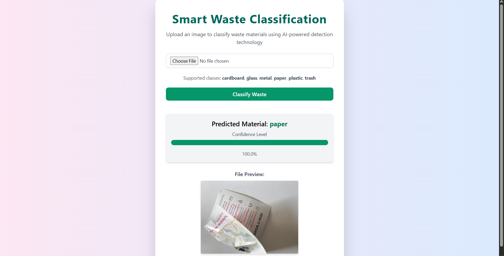

# Smart Waste Classification System 

- A deep learning project that **automatically classifies waste** into six categories **cardboard, glass, metal, paper, plastic, and trash** using **CNNs and transfer learning (ResNet50)**.  
- Deployed as a **Flask web app** and containerized with **Docker** for easy deployment.

---

##  Overview
- Addresses poor waste segregation and recycling inefficiency.
- Uses AI-based image classification to identify waste type.
- Achieved **93% accuracy** with **ResNet50 (transfer learning)**.
- Integrated **OpenCV** for real-time detection via webcam.

---

## ⚙️ Tech Stack
- **Backend:** Flask  
- **Frontend:** HTML, Tailwind CSS  
- **Model:** TensorFlow / Keras (ResNet50)  
- **Real-time Detection:** OpenCV  
- **Containerization:** Docker

## 🖼️ Web App Preview

